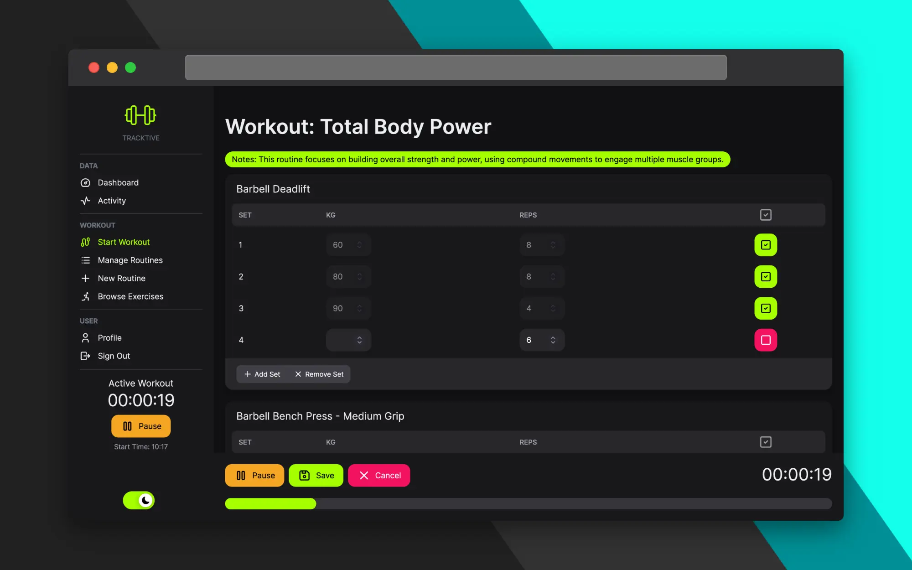

# Tracktive - Full stack workout tracking app

Full stack workout tracking app. Browse over 800 exercises, create your own routines, record your workouts and view your data with beautiful charts. Built with Next.js 14, Clerk and Postgres

## Demo

Link to a live demo: [Live Demo](https://tracktive.vercel.app)

## Features

- Coming Soon

## More info on my website

Link to blog post: [Blog Post](https://cwaitt.dev/projects/tracktive)
